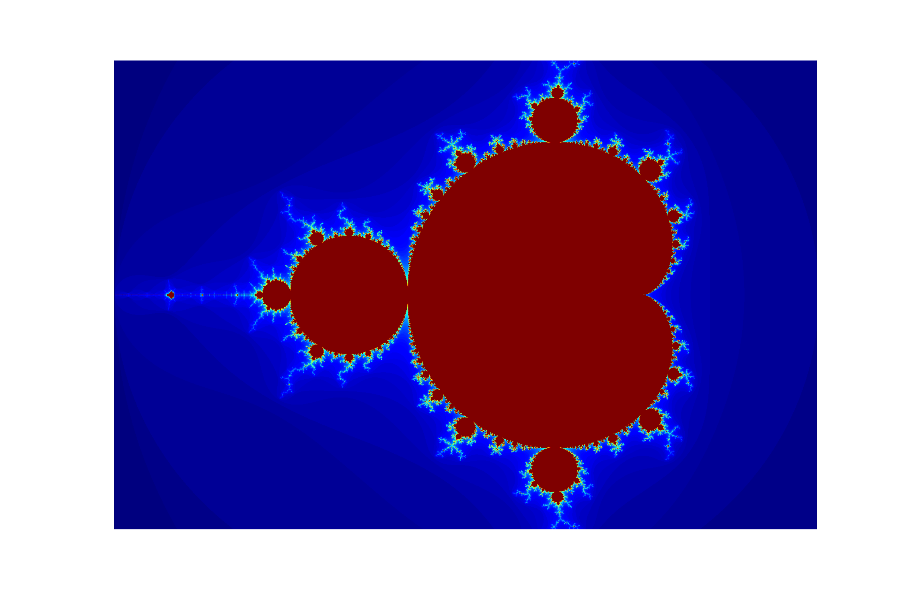

Distributed computation of the Mandelbrot Set using IPython Parallel

Author: Cosmo Harrigan, based on Mandelbrot code by Jake Vanderplas

Run ```ipython notebook``` and open ```fractal.ipynb``` to view.

[Notebook Viewer link]()


